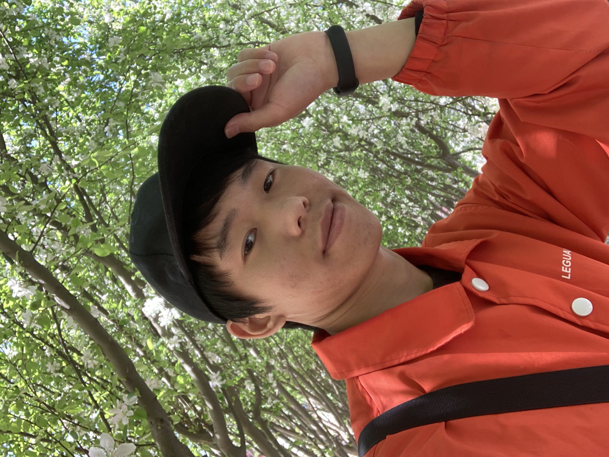

# Liu Peng （刘鹏）

[Curriculum Vitae](CV_Liu_Peng_HEBUT.pdf), [Selected Awards Credentials](Credentials_Liu_Peng_HEBUT.pdf)

**E-mail:** LiuPeng_NGP@outlook.com

**Research Interests:**  Generative Models, Deep Learning, Computer Vision, Natural Language Processing, Artificial Intelligence

**Attention please:** I am looking for a **research assistant job** related to my research interests.
I sincerely hope to have the opportunity to do some meaningful work and publish some papers.

**Vision:** In a long run, I believe that the real artificial intelligence like human will come true, and it will make great social good. I would like to devote myself to artificial intelligence. For now, I think generative artificial intelligence and multimodal (CV, NLP, etc.) are important to the realization of real artificial intelligence.

- *We choose to go to the moon. We choose to go to the Moon... We choose to go to the moon in this decade and do the other things, not because they are easy, but because they are hard, because that goal will serve to organize and measure the best of our energies and skills, because that challenge is one that we are willing to accept, one we are unwilling to postpone, and one which we intend to win, and the others, too.* John F. Kennedy

**Education:**
- [Hebei University of Technology](https://eweb.hebut.edu.cn/)
  - B.Eng. Computer Science and Technology
  - August 2019 - June 2023
  - Outstanding graduate
  - Bachelor thesis: [生成模型研究与中国画生成 (Generative Models Research and Chinese Painting Generation)](Thesis_Bachelor_Liu_Peng_HEBUT.pdf) 

<!-- #### I am looking for a research assistant job on generative models for about three years (2023-2026). I hope to publish two or three papers on generative models during the work period. In my spare time, I hope to write an English book on generative models. -->

