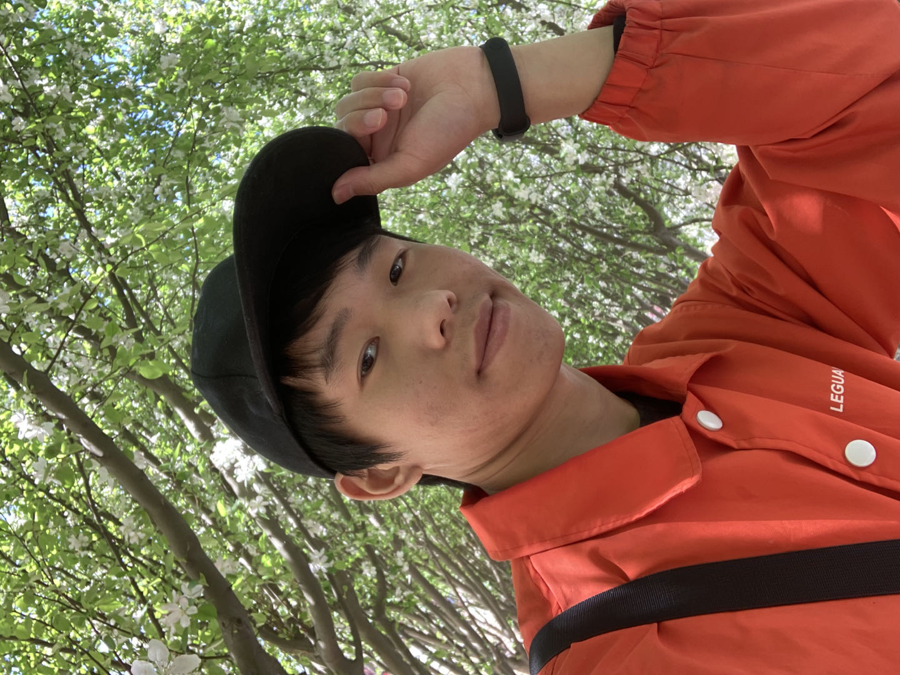

# Liu Peng 刘鹏

**Email:** LiuPeng_NGP@outlook.com

I previously worked as a Research Assistant at **[Westlake University](https://en.westlake.edu.cn/)**, advised by **[Prof. Yaochu Jin](https://en.westlake.edu.cn/faculty/yaochu-jin.html)**. I received my B.Eng. in Computer Science and Technology from **[Hebei University of Technology](https://eweb.hebut.edu.cn/)**.

My current research interests include **generative models, long-context modeling, AI safety and robotics**.

---

### Publications

- **Robustness of Probabilistic Models to Low-Quality Data: A Multi-Perspective**. Liu Peng, Yaochu Jin. *ICLR 2026*. [OpenReview](https://openreview.net/forum?id=ZFZhV7Snf4)

- **An Information-Theoretic Unification of Intelligence**. Liu Peng, Yaochu Jin. *Under review*. [PDF](https://openreview.net/pdf?id=KnXxxoAqPh)

---

### Education

- **[Hebei University of Technology](https://eweb.hebut.edu.cn/)**, B.Eng. Computer Science and Technology, 2019 - 2023

---

### Experience

- **[Westlake University](https://en.westlake.edu.cn/)**, Research Assistant, 2024 - 2026. Trustworthy and General Artificial Intelligence Laboratory

- **Zseads Technology**, Algorithms Engineer, 2023. Image generation
